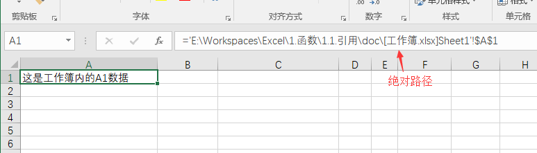
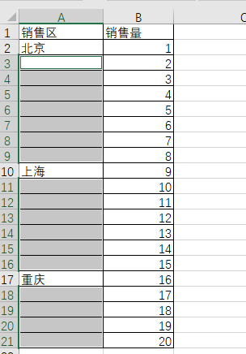

Excel引用与定位
--------------

**目录**

- [一、引用](#一引用)
    - [1.同文件同sheet引用](#1同文件同sheet引用)
        - [1.1简单示例](#11简单示例)
        - [1.2相对引用](#12相对引用)
        - [1.3绝对引用](#13绝对引用)
        - [1.4混合引用](#14混合引用)
        - [1.5引用切换](#15引用切换)
        - [1.6名称引用](#16名称引用)
    - [2.同文件不同sheet引用](#2同文件不同sheet引用)
        - [2.1基本示例](#21基本示例)
        - [2.2特殊字符处理](#22特殊字符处理)
        - [2.3快速选择](#23快速选择)
    - [3.不同文件之间引用](#3不同文件之间引用)
- [二、定位](#二定位)
    - [1.简单定位](#1简单定位)
    - [2.复杂定位](#2复杂定位)
    
# 一、引用

## 1.同文件同sheet引用

“单元格引用”在excel中十分重要，尤其在函数公式中会被大量使用，所以先以引用开始。
    
### 1.1简单示例

    Excel中"列"以英文大写字母A-Z表示，超过26列后则循环追加字母，比如27列为AA。
    Excel中"行"以阿拉伯数字表示。

以最简单的`A1`为例，`A1`代表“单个”单元格地址，表示`A列`与`1行`交叉。

`A1:B3`代表“多个”单元格地址即区间，表示`A1`与`B3`之间的单元格。

> 备注：A:A或2:2也可选择区间，这里表示整列或整行

### 1.2相对引用

> 相对引用：复制公式时地址跟着发生变化。

`A1`即是列与行均是“相对引用”，下拉复制时，行数变化`A1`变成`A2`；右拉复制时，列数变化`A1`变成`B1`。

`Ctrl+~`查看所有公式：

### 1.3绝对引用

> 绝对引用：复制公式时地址不会跟着发生变化。

`$A$1`表示绝对引用，在列与行前都增加美元符`$`(这里`$`符表示锁定)，这时复制公式地址不会改变。

`Ctrl+~`查看所有公式：

### 1.4混合引用

> 混合引用：复制公式时地址的部分内容跟着发生变化。

`$A1`与`A$1`都表示混合引用。不同的是，`$A1`为列锁定，行变化；`A$1`为列变化，行锁定。

`Ctrl+~`查看所有公式：

### 1.5引用切换

在“公式编辑模式”下，即双击或`F2`所选的单元格。按`F4`可以在上述几种引用下进行切换。

### 1.6名称引用

> 名称引用：在表格数据量较大或者经常需要使用的引用时，我们可以给引用定义一个名称。

名称定义的方式有：

1.选择单元格或区域，在名称框输入名称，回车即定义好名称。

2.点击菜单栏，`公式`→`名称管理器`，管理名称。

> 名称可以为英文或汉字，但最好不要以单个大写字母表示，容易引起歧义。

## 2.同文件不同sheet引用

### 2.1基本示例

不同sheet之间的引用方式为`=工作表名!单元格地址`。

如：Sheet2引用Sheet1中`$A$1`单元格，则用`=Sheet1!$A$1`表示即可。

### 2.2特殊字符处理

当Sheet名字中包含空格等特殊字符，则Sheet名必须用单引号`''`括起来，如：

### 2.3快速选择

当然上面输入的方式还是比较麻烦，这里可以使用快捷键快速选择。

## 3.不同文件之间引用

不同文件中的引用方式为`=[工作簿名]工作表名!单元格地址`。
如存在特殊字符，可以将`[工作簿名]工作表名`用单引号`''`括起来，即引用方式为`='[工作簿名]工作表名'!单元格地址`。

回车后，数据显示，同时公式栏相对路径自动改成绝对路径。

# 二、定位

## 1.简单定位

> 定位不同于查找。

简单定位：比如我们需要定位到B6这个单元格，则需要按`F5`或`Ctrl+G`，在引用位置输入`B6`，确定。
Excel自动选中`B6`单元格。

当然，我们也可以定位区间，比如输入`A2:B6`，则选中A2值B6区间。

## 2.复杂定位

按`F5`或`Ctrl+G`弹出定位框，点击`定位条件`，会有多种选择条件。

这里先介绍一种使用场景，后续再对其他定位条件进行补充说明。

1. 我们需要对以下Excel进行填充，将销售区的空白处填充为空白上方数据。

2. 选中上图标红区域，按`F5`或`Ctrl+G`弹出定位框，点击`定位条件`，选择`空值`。

3. 确定后，可以看到该区域内的空白区域都被选中。

4. 在公式编辑栏，输入`=A2`。

5. 按`Ctrl+回车`，则可对空白区域进行填充。

6. 如果想要删除该填充内容，则需要选择该区域，按`F5`或`Ctrl+G`弹出定位框，点击`定位条件`，选择`公式`。

7. 确定后，可以看到该区域内的`公式`区域都被选中。

8. 按`Delete`按键即可删除。

