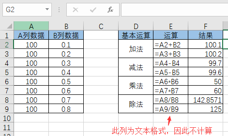
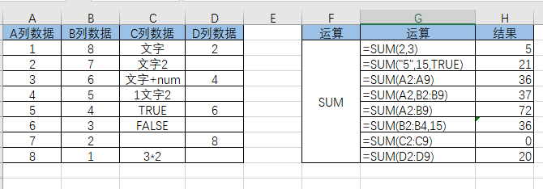

Excel的基本运算
--------------

**目录**

- [一、四则运算](#一四则运算)
- [二、求和运算](#二求和运算)

# 一、四则运算

四则运算最为简单，`+`，`-`，`*`，`/`表示加减乘除。
使用也简单，`=A1+B1`表示单元格`A1`数据与单元格`B1`数据相加。

# 二、求和运算

## 2.1SUM函数

> SUM函数：返回某一单元格区域中所有数字之和。

**语法：**

SUM(number1,number2, ...)

其中number1, number2, ...为1到30个需要求和的参数。

**说明：**

1. 直接键入到参数表中的数字、逻辑值及数字的文本表达式将被计算。
2. 如果参数为数组或引用，只有其中的数字将被计算。数组或引用中的空白单元格、逻辑值、文本或错误值将被忽略。
3. 如果参数为错误值或为不能转换成数字的文本，将会导致错误。

**示例：**

1. `=SUM(3,2)` 将3和2相加等于5。
2. `=SUM("5",15,TRUE)` 将5、15和1相加，文本值"5"被转换为数字5，逻辑值TRUE=1，FALSE=0。
3. `=SUM(A2:A9)` 将A列2到9行八个数相加。
4. `=SUM(A2,B2:B9)` 将A列2行和B列2到9行九个数相加。
5. `=SUM(A2:B9)` 将A列2到9行与B列2到9行十六个数相加。
6. `=SUM(B2:B4,15)` 将B列2到4行三个数与15相加。
7. `=SUM(C2:C9)` 单元格包含不能转换成数字的文本，一般都会都成FLASE，即0处理。
8. `=SUM(D2:D9)` 空值不相加。

